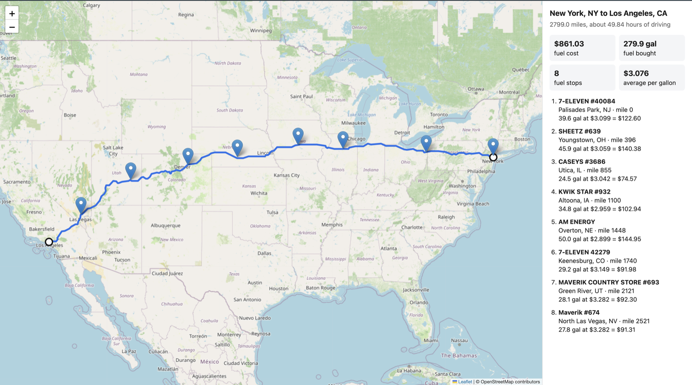
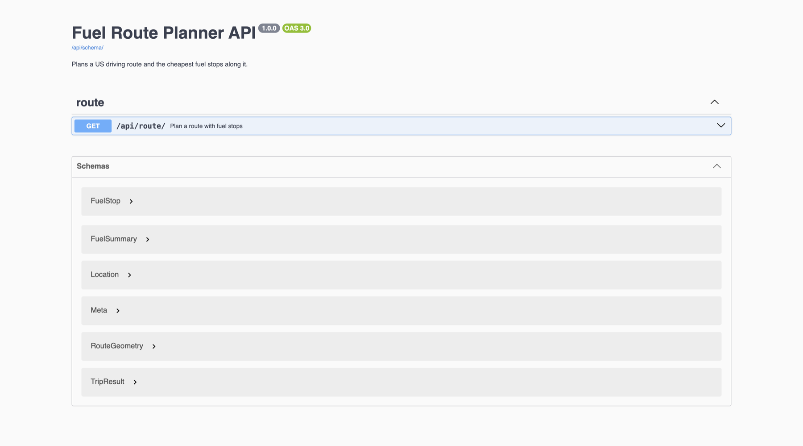
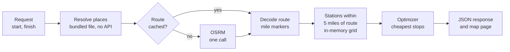

# Fuel Route Planner

A Django API that takes a start and a finish location in the USA and returns the driving route, the cheapest places to refuel along it, and the total fuel cost.

[](https://github.com/ShahFuroq/fuel-route-planner/actions/workflows/tests.yml)


[Demo video](https://www.loom.com/share/73064ea41fcf48978c309a1eb94a63e2) · [Requirements](#requirements-checklist) · [Quick start](#quick-start) · [API](#api-reference) · [How it works](#how-it-works) · [Results](#results-and-performance) · [Structure](#project-structure) · [Testing](#testing-and-ci) · [With more time](#with-more-time)



**Demo video:** [5-minute walkthrough on Loom](https://www.loom.com/share/73064ea41fcf48978c309a1eb94a63e2), showing the API in Postman and a short code overview.

## Highlights

- **One routing API call per request**, and none when the route is already cached.
- **An exact optimizer.** The stops are the provably cheapest for the stated objective, not a greedy guess, and the tests check it against exhaustive search.
- **About 1 second for a cross-country route**, almost all of it the routing call. Local processing is about 60 ms; a cached request takes about 3 ms.
- **66 tests**, run in CI on SQLite and PostgreSQL, with lint and format checks.

## The assignment

Build an API, on the latest stable Django, that:

- takes a start and a finish location, both in the USA;
- returns a map of the route and the optimal places to refuel, where optimal mostly means cheapest;
- assumes a vehicle range of 500 miles, so long routes need several stops;
- returns the total money spent on fuel at 10 miles per gallon;
- uses the supplied fuel price file;
- uses a free map and routing API, calls it as little as possible (one call is ideal, two or three acceptable), and responds quickly.

## Requirements checklist

| Requirement | Status | Where to see it |
|---|---|---|
| Latest stable Django | Done | Django 6.1.1 in `requirements.txt` |
| Start and finish within the USA | Done | `City, ST`, ZIP code or `lat,lng`; anything outside the 48 contiguous states returns a clear 400 |
| Map of the route | Done | `route` (GeoJSON) in the response, and a rendered map at `map_url` |
| Optimal fuel stops by price | Done | `stops` in the response; chosen by an exact optimizer ([details](#choosing-the-stops)) |
| 500-mile range, multiple stops | Done | No leg between stops exceeds 500 miles; covered by tests |
| Total fuel cost at 10 mpg | Done | `fuel.total_cost` and `fuel.total_gallons` |
| Uses the supplied price file | Done | `python manage.py load_fuel_stations` loads all 6,626 US stations |
| Free routing API | Done | Public OSRM server, no API key |
| One routing call ideal | Done | Exactly one per request, zero when cached; reported in `meta.routing_api_calls` |
| Fast responses | Done | About 1 s uncached, about 3 ms cached ([measurements](#results-and-performance)) |

## Beyond the requirements

Not asked for, added because they make the result more useful or the code easier to trust:

- **Stop penalty.** The pure cheapest plan for New York to Los Angeles makes 16 stops. A small per-stop cost (`stop_penalty`, default $5) brings that to 8 stops for 0.5% more money.
- **No geocoding API.** Places are resolved from a bundled file, so the only outbound call is the routing one.
- **Map page.** The same plan rendered on a Leaflet map, with no extra routing call.
- **Interactive API docs.** Swagger UI and an OpenAPI 3 schema, generated from the serializers.
- **Caching.** The route and the plan are cached separately, so changing `stop_penalty` reuses the route.
- **Clear errors.** One place maps failures to status codes: 400, 422, 502, 503, 504.
- **Timings in every response.** `meta.timings_ms` shows where the time went.
- **CI.** Lint, format check, and the test suite on SQLite and PostgreSQL.
- **Logging.** One line per planned trip and a warning when the routing service fails.

## Tech stack

| Area | Choice |
|---|---|
| Language | Python 3.12+ |
| Framework | Django 6.1, Django REST Framework 3.18 |
| API docs | drf-spectacular (OpenAPI 3, Swagger UI) |
| Routing | OSRM public server, one request per trip |
| Place lookup | GeoNames US postal code file, bundled |
| Database | SQLite by default, PostgreSQL through `DATABASE_URL` |
| Cache | In-process memory by default, Redis through `REDIS_URL` |
| Map | Leaflet with OpenStreetMap tiles |
| Tooling | ruff (lint and format), GitHub Actions |

## Quick start

Requires Python 3.12 or newer.

```bash
python -m venv .venv && source .venv/bin/activate
pip install -r requirements.txt
python manage.py migrate && python manage.py load_fuel_stations
python manage.py runserver
```

Then open or request:

```
http://127.0.0.1:8000/api/route/?start=New York, NY&finish=Los Angeles, CA
```

- Swagger UI: `http://127.0.0.1:8000/api/docs/`
- Postman collection: `postman/fuel-route-planner.postman_collection.json`

## API reference

### `GET /api/route/`

| Parameter | Required | Description |
|---|---|---|
| `start` | yes | `City, ST`, a 5-digit ZIP code, or `lat,lng` |
| `finish` | yes | Same forms as `start` |
| `stop_penalty` | no | Dollar cost assigned to each stop when choosing stops. Default 5. Use 0 for the absolute cheapest fuel cost. |
| `start_fuel_gallons` | no | Fuel already in the tank, 0 to 50. Default 0. |

<details>
<summary>Sample response (shortened)</summary>

```json
{
  "start": {"query": "New York, NY", "name": "New York, NY", "lat": 40.75919, "lng": -73.98172},
  "finish": {"query": "Los Angeles, CA", "name": "Los Angeles, CA", "lat": 34.03372, "lng": -118.28135},
  "distance_miles": 2799.0,
  "duration_hours": 49.84,
  "fuel": {
    "mpg": 10.0, "range_miles": 500.0, "start_fuel_gallons": 0.0, "stop_penalty": 5.0,
    "total_gallons": 279.9, "total_cost": 861.03, "average_price_paid": 3.076, "stop_count": 8
  },
  "stops": [
    {
      "order": 1, "station_id": 62790, "name": "7-ELEVEN #40084", "address": "US-46/US-1/US-9",
      "city": "Palisades Park", "state": "NJ", "lat": 40.8462, "lng": -73.9954,
      "mile_marker": 0.0, "miles_off_route": 6.1,
      "price_per_gallon": 3.099, "gallons": 39.56, "cost": 122.6
    }
  ],
  "route": {"type": "LineString", "coordinates": [[-73.98194, 40.7589], "..."]},
  "map_url": "http://127.0.0.1:8000/api/route/map/?start=New+York%2C+NY&finish=Los+Angeles%2C+CA",
  "meta": {
    "routing_api_calls": 1, "route_cache_hit": false,
    "timings_ms": {"resolve_locations": 75.0, "routing_api": 884.2, "geometry": 59.4,
                   "corridor_search": 14.3, "optimizer": 13.1, "total": 1082.6},
    "corridor_miles": 5.0,
    "assumptions": ["..."]
  }
}
```

</details>

`route` is GeoJSON, thinned to at most 1,500 points. `map_url` opens the same plan on a map.

Errors return a JSON body with an `error` message:

| Status | When |
|---|---|
| `400` | Input is missing, unreadable, unknown, or outside the 48 contiguous states. Validation errors add a `details` object naming the field. |
| `422` | A stretch of the route has no station within range. The body gives the `gap` in miles. |
| `502` / `504` | The routing service failed or timed out. |
| `503` | Fuel station data has not been loaded. |

### `GET /api/route/map/`

Same parameters. Renders the route and the fuel stops on a Leaflet map (the screenshot at the top). It reuses the cached route, so it adds no routing call.

### `GET /api/docs/` and `GET /api/schema/`

Swagger UI and the OpenAPI 3 schema, generated from the serializers.



## How it works



1. **Resolve the places locally.** Start and finish are looked up in a bundled place file. No geocoding API is called.
2. **One routing call.** The public [OSRM](https://project-osrm.org/) server returns the distance, duration and full route geometry in a single request. It needs no API key. The route is cached, keyed on the rounded coordinates.
3. **Find stations near the route.** The route is decoded and given mile markers. Stations are held in memory in a grid index, and those within 5 miles of the route are kept, each with the mile marker of its closest route point.
4. **Choose the stops.** See below.
5. **Return the plan** and cache it. Changing `stop_penalty` or `start_fuel_gallons` reuses the cached route.

### Choosing the stops

The route becomes a line of fuel points, each with a mile marker and a price. The optimizer minimises fuel cost plus a fixed penalty per stop, and is exact for that objective.

It uses a known property of this problem (Khuller, Malekian and Mestre, *To Fill or Not to Fill: The Gas Station Problem*): in an optimal plan, at each stop you either buy just enough to reach the next stop empty, or you fill the tank. So the fuel on arrival is always zero or "a full tank minus the distance from the previous stop", and a dynamic programme over (station, fuel on arrival) stays small. It runs in about 13 ms on a cross-country route with about 365 candidate stations.

The stop penalty exists because the pure minimum-cost plan is impractical. Measured on New York to Los Angeles (2,799 miles, 279.9 gallons):

| `stop_penalty` | Fuel cost | Stops |
|---|---|---|
| 0 (absolute minimum cost) | $857.09 | 16 |
| **5 (default)** | **$861.03** | **8** |
| 25 | $886.23 | 6 |

The default costs 0.5% more than the minimum and makes half the stops. The penalty only steers the choice; it is never added to the reported cost.

## Results and performance

Real requests against the public OSRM server, on SQLite with the in-memory cache:

| Route | Distance | Stops | Fuel cost | Routing calls | Response time |
|---|---|---|---|---|---|
| New York, NY to Los Angeles, CA | 2,799.0 mi | 8 | $861.03 | 1 | 1.2 s |
| Seattle, WA to Miami, FL | 3,304.5 mi | 9 | $1,034.81 | 1 | 0.9 s |
| Dallas, TX to Chicago, IL | 966.6 mi | 3 | $277.89 | 1 | 0.7 s |
| New York to Los Angeles, repeated | 2,799.0 mi | 8 | $861.03 | 0 | 4 ms |
| New York to Los Angeles, new `stop_penalty` | 2,799.0 mi | 6 | $886.23 | 0 | about 60 ms |

Where the time goes on an uncached cross-country request (about 1.1 s in total):

| Step | Time |
|---|---|
| Routing API call | about 880 ms |
| Resolve places | about 75 ms on the first request, then negligible |
| Decode route and mile markers | about 60 ms |
| Find stations near the route | about 15 ms |
| Optimizer | about 13 ms |

The routing call is the only slow part, which is why it is made once and cached.

## Data

`python manage.py load_fuel_stations` loads `data/fuel-prices-for-be-assessment.csv`. It can be run again safely.

- The file has 8,151 rows. 620 are Canadian and are skipped, leaving **6,626 US stations** in the 48 contiguous states.
- **Duplicate stations.** 568 US station IDs appear more than once, 487 of them with different prices (same rack ID and address, so they read as repeated price observations of one station). Every raw row is kept in `FuelPriceObservation`; the station's price is their average. The file has no date to pick the latest by, and using the lowest would understate the cost.
- **Coordinates.** The file has no coordinates, and its addresses are highway descriptions such as `I-44, EXIT 283 & US-69`. Each station is placed at the centre of its town, matched by city and state against the [GeoNames](https://www.geonames.org/) US postal code file (licensed CC BY 4.0). All 6,626 stations are matched.

## Assumptions and limits

- **Starting fuel.** The assignment does not say how much fuel the vehicle starts with. By default the tank starts empty and the trip begins with a fill-up at the cheapest station within 10 miles of the start (or the nearest one, if none is that close), so every gallon burned is paid for and a short trip does not report $0. `start_fuel_gallons` changes this; that fuel is not charged.
- **Arriving empty.** The plan buys only the fuel the trip burns.
- **Station positions are town centres**, so a station can be a few miles from where it is shown. This is why "along the route" means within 5 miles. If a stretch has no reachable station, the search widens once to 15 miles.
- **Detours are not counted.** Driving from the route to a station and back adds no distance or fuel.
- **Coverage.** Alaska and Hawaii are rejected because the price file has no stations there.
- **Routing server.** The public OSRM server is a shared demo service with no uptime guarantee. The server is a setting (`OSRM_BASE_URL`), requests have a timeout, and failures return a clear error.

## Project structure

```
config/                         settings and URLs
routing/
  models.py                     FuelStation, FuelPriceObservation
  management/commands/          load_fuel_stations
  services/
    locations.py                resolve a place to coordinates, offline
    osrm.py                     the single routing call
    geometry.py                 polyline decoding, distances, mile markers
    corridor.py                 stations near the route
    optimizer.py                fuel stop selection
    trip.py                     the result types (TripPlan, FuelStop)
    planner.py                  orchestrates the steps, with caching
  serializers.py                query validation and response shape
  errors.py                     exception to HTTP status mapping
  views.py, urls.py
  templates/routing/map.html
  tests/
data/                           fuel price CSV, GeoNames place file
docs/images/                    screenshots used in this README
postman/                        Postman collection
```

## Design decisions

The code is split so that each part can be read, tested and replaced on its own:

- **Services hold the logic and know nothing about HTTP.** `optimizer.py` and `geometry.py` are plain Python with no Django imports. `planner.py` only orchestrates the steps and returns a typed `TripPlan`.
- **Serializers own the API contract.** One validates the query; another shapes the `TripPlan` into the response. The OpenAPI schema is generated from them, so the docs cannot drift from the code.
- **Errors are mapped in one place** (`errors.py`). Services raise their own exceptions; a DRF exception handler turns them into status codes. The map page uses the same mapping.
- **The database is the source of truth; memory is the working copy.** Stations are read once per process into a grid index. No spatial queries run per request, which is why the station table has no lookup indexes beyond its unique ID.
- **The routing provider is behind one function** (`fetch_route`) and one setting, so it can be replaced without touching the planner.
- **PostGIS is not used.** The spatial work is a 15 ms in-memory grid lookup over 6,626 points, which does not justify the extra setup.

## Testing and CI

```bash
pip install -r requirements-dev.txt
ruff check . && ruff format --check .   # lint and formatting
python manage.py test                   # 66 tests, no network needed
```

| Area | Tests | What they check |
|---|---|---|
| API | 21 | Response shape, range limit, caching and call count, every error status, schema and docs |
| Optimizer | 10 | Matches an independent greedy algorithm (no penalty) and exhaustive search (with a penalty) on random inputs |
| Place lookup | 9 | City, ZIP and coordinate inputs; unsupported states |
| Geometry | 7 | Polyline decoding, distances, mile markers, route thinning |
| Station search | 6 | Radius, ordering along the route, northern latitudes, starting station |
| Data loader | 5 | Canadian rows skipped, duplicates averaged, safe to re-run |
| Routing client | 4 | Success, timeout, failure, no route |
| Models | 4 | Price and coordinate constraints, unique station ID |

The routing call is mocked in the tests, so they run offline. CI runs the linter, then the tests on SQLite and on PostgreSQL, where it also runs the data load.

## Configuration

Everything has a working default. Optional settings go in `.env` (see `.env.example`):

- `DATABASE_URL` switches from SQLite to PostgreSQL. SQLite is the default so the project runs with no setup.
- `REDIS_URL` switches the cache from in-process memory to Redis (needs `pip install redis`), which is what a multi-process deployment needs. This path is configured but has not been exercised.
- `OSRM_BASE_URL`, `OSRM_TIMEOUT_SECONDS`, `DEFAULT_STOP_PENALTY`, `LOG_LEVEL`.

Logging goes to the console: one line per planned trip (distance, stops, cost, routing calls, time) and a warning whenever the routing service fails.

## With more time

Left out on purpose to keep the scope to what was asked. In order of what I would add first for production:

1. **Rate limiting** (DRF throttling). The endpoint is public and each uncached request calls a third-party service.
2. **A shared cache and a route table.** Redis for the cache, and routes persisted in PostgreSQL, so results survive restarts and are shared across workers.
3. **A self-hosted OSRM or a paid routing provider** with an uptime guarantee, plus a retry with backoff.
4. **Exact station positions.** About half the addresses name an interstate exit, which could be matched to OpenStreetMap junctions offline.
5. **Cache invalidation by data version** instead of clearing the cache when prices are reloaded.
6. **Docker Compose** with PostgreSQL and Redis for a one-command setup.
7. **API versioning** (`/api/v1/`) before a second client depends on the contract.
8. **Subresource integrity hashes** on the map page's CDN assets, or self-hosting them.
9. **Warm-up on start.** The first request after a restart is slower (about 3 seconds measured once) because the place file and station index load on first use.

## Credits

- Routing by [OSRM](https://project-osrm.org/); map data and tiles © [OpenStreetMap](https://www.openstreetmap.org/copyright) contributors.
- Place data from [GeoNames](https://www.geonames.org/), licensed CC BY 4.0.
